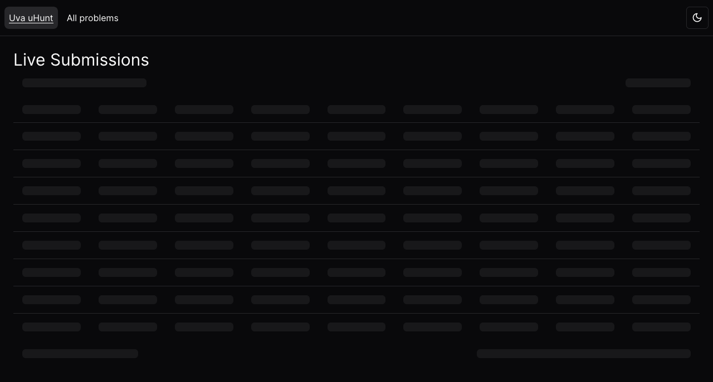
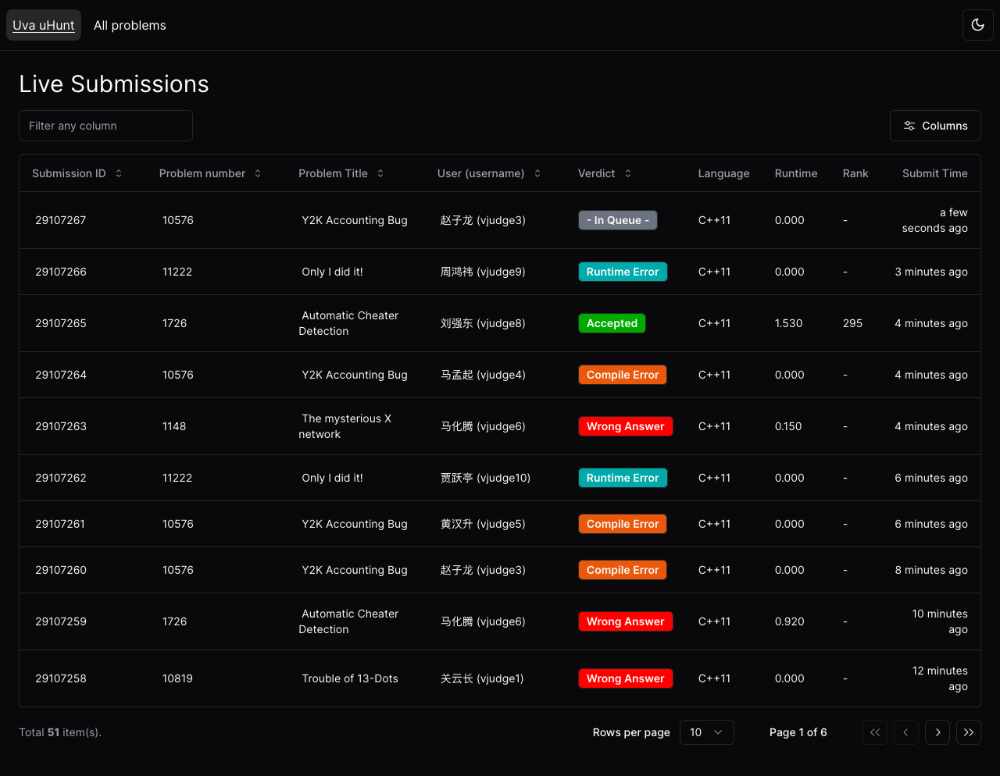
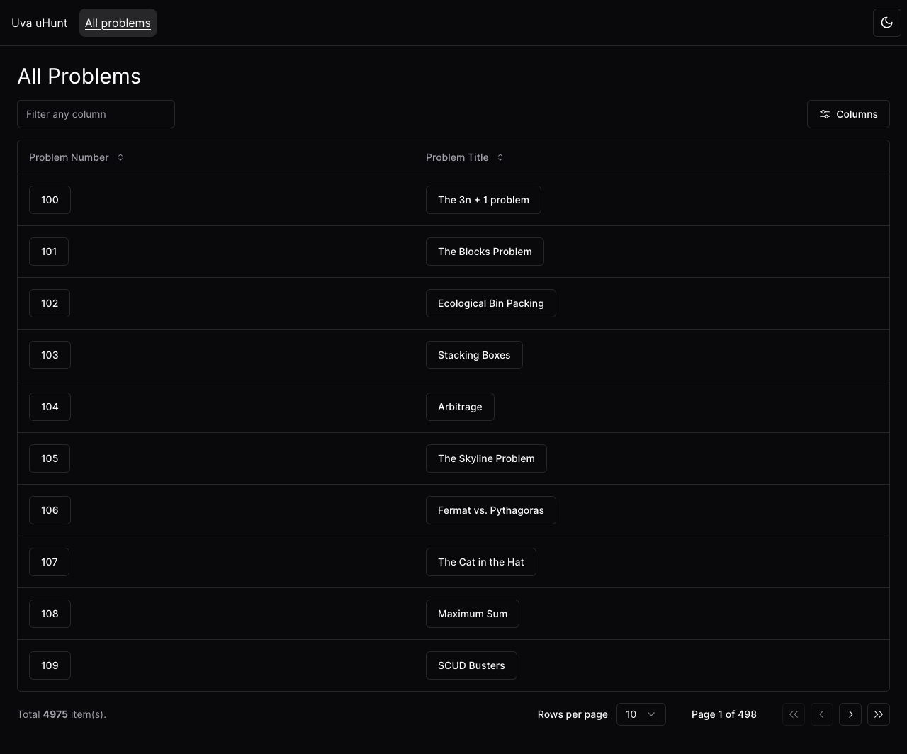
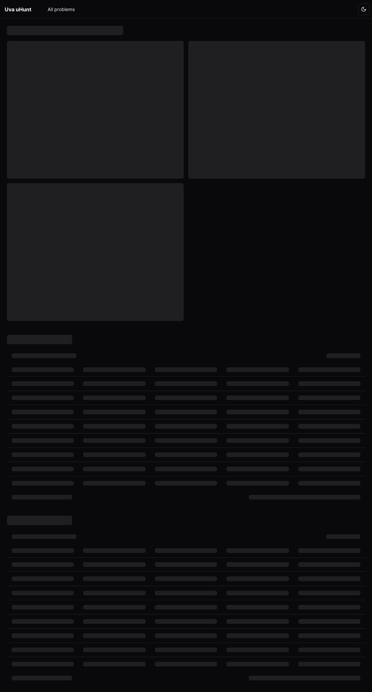

# uva-uhunt

visual redesign of [uva-uhunt](https://uhunt.onlinejudge.org/)

Using

- [Shadcn-ui](https://ui.shadcn.com/)
- [Talwindcss](https://tailwindcss.com/)
- [uva uhunt API](https://uhunt.onlinejudge.org/api)
- [Recharts](https://recharts.org/en-US/)
- [zod](https://zod.dev/)

---

This is a [Next.js](https://nextjs.org/) project bootstrapped with [`create-next-app`](https://github.com/vercel/next.js/tree/canary/packages/create-next-app).

## Getting Started

First, run the development server:

```bash
npm run dev
# or
yarn dev
# or
pnpm dev
# or
bun dev
```

Open [http://localhost:3000](http://localhost:3000) with your browser to see the result.

## Screenshots

<details>
<summary>Show screenshots</summary>

### Navbar


### Home page (live submissions)




### Problems page (`/problems`)




### Problems page (`/problems/[problemNum]`)



### Username page (`/users/[username]`)


</details>
